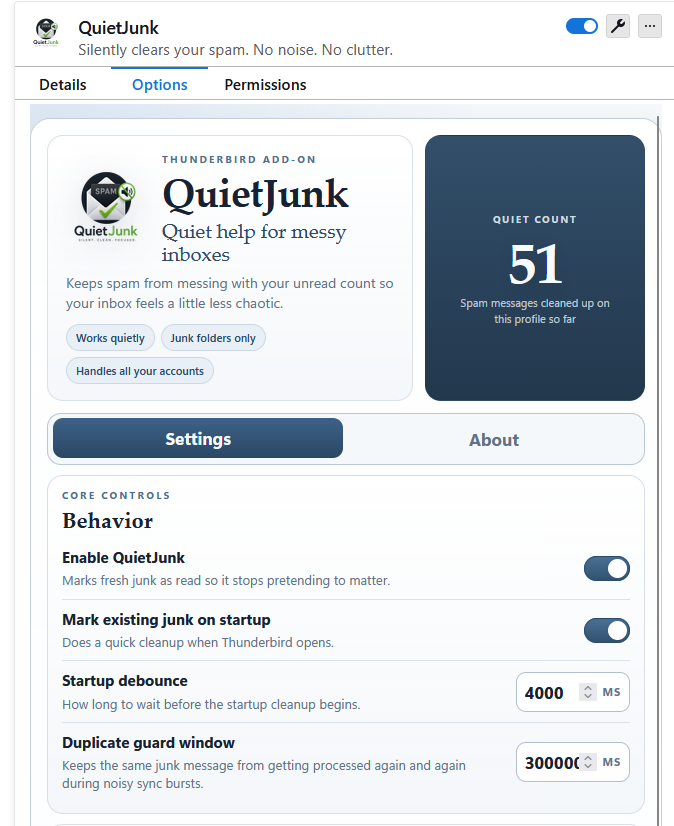

# QuietJunk

Quiet help for messy inboxes.

QuietJunk is a Thunderbird add-on that keeps spam from messing with your unread count. When Thunderbird recognizes mail as junk, QuietJunk quietly marks it as read so your real inbox can stop sharing attention with the junk drawer.

It is intentionally small: no deleting, no moving, no cloud service, no message scoring, no drama. Thunderbird decides what is junk. QuietJunk just cleans up the little unread badge that junk leaves behind.

Current beta build: `0.0.5`

## What It Does

- Marks unread junk mail as read automatically.
- Cleans existing unread junk when Thunderbird starts.
- Keeps an eye on junk folders while Thunderbird stays open or minimized.
- Gives you a manual cleanup button when you want to bonk the count right now.
- Lets you exclude accounts that should stay untouched.
- Shows a quiet count of how much inbox noise it has cleaned up.

## What It Does Not Do

- It does not delete messages.
- It does not move messages to trash.
- It does not scan message contents outside Thunderbird's local extension APIs.
- It does not send mail data anywhere.
- It does not promise provider-specific Gmail spam behavior yet.

## Supported Baseline

QuietJunk works best with Thunderbird folders that Thunderbird itself exposes as junk folders. Most normal junk folders should behave cleanly. Provider-specific spam folders, especially Gmail, can be weird and are still best-effort during beta.

## Options

The add-on preferences page includes:

- enable or disable QuietJunk
- mark existing junk on startup
- startup cleanup delay
- duplicate-processing guard window
- account exclusions
- quiet count and reset
- manual cleanup
- optional diagnostic logging

## Local Testing

1. Open Thunderbird.
2. Go to the Add-ons Manager debug page.
3. Choose `Load Temporary Add-on`.
4. Select `manifest.json` from this folder.
5. Open the add-on Preferences view to confirm the Settings and About tabs render correctly.
6. Send or move a test message into Junk and watch the extension console.

## Project Structure

- `manifest.json`
- `src/background.js`
- `src/spamHandler.js`
- `src/settings.js`
- `src/logger.js`
- `ui/options.html`
- `ui/options.css`
- `ui/options.js`
- `icons/`
- `assets/screenshots/`
- `CHANGELOG.md`
- `PRIVACY.md`
- `ROADMAP.md`
